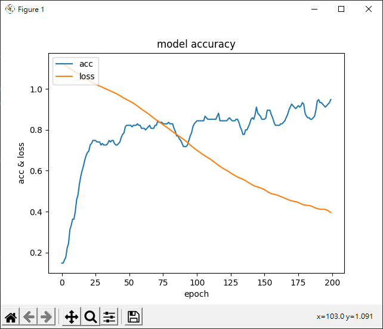

# Tensor Flow 圖形化顯示

_參照code：3.TensorFlow_Show.py_

利用圖形化的方式把訓練過程顯示出來，透過觀察圖形可以更有效的調整模組。

範例用鳶尾花做測試，訓練的時候只要拿變數乘載，在做完訓練後就可以使用。

```python
history=model.fit(X_Train, Y_Train2,
          epochs=200,
          batch_size=128)
```

利用Matplotlib畫出損失率跟準確率的狀況。


```python
import matplotlib.pyplot as plt

plt.plot(history.history['accuracy'])
plt.plot(history.history['loss'])
plt.title('model accuracy')
plt.ylabel('acc & loss')
plt.xlabel('epoch')
plt.legend(['acc', 'loss'], loc='upper left')
plt.show()
```

在圖片中可以看到，這次的模組訓練，損失率越來越低、準確率越來越高，這是一個不錯的發展，但依然可以靠調整把結果更佳化。

