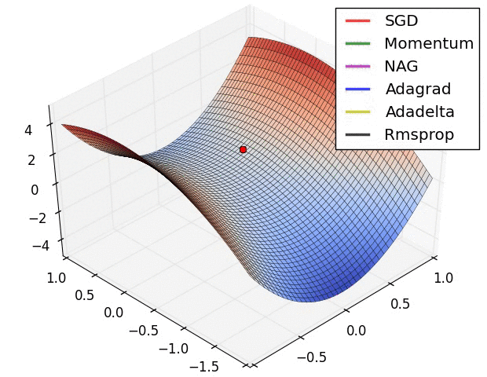
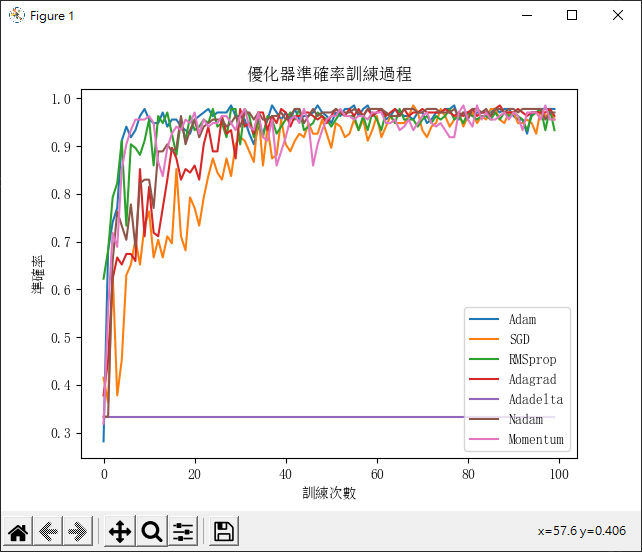

# 深度學習最佳化

optimizer(優化器)，在編譯的時候可以選擇適當的optimizer參數，簡單來說optimizer就是幫助調整參數，使得Loss越來越小。

每個優化器在訓練速度上都有差異。



_圖片來源：[Alec Radford](https://twitter.com/alecrad)_


一般常見使用：

+ SGD 準確率梯度下降法
  + 適合變化幅度較大的資料。
  + 會用到所有訓練資料，所以速度可能很慢。
  + 需要設定Learning rate，較難調整到適當的值。
+ RMSprop
+ adagrad
  + 適合變化幅度較大的資料。
+ Adadelta
+ Adam
  + 結合了AdaGrad、Momentum兩者的優點。
  + 適用大數據、高維度資料。
  + 最常使用的優化器。
+ Adamax
+ Nadam

然而挑選優化器最快的方式，就是直接看訓練過程，繪製成圖形。

<br/>
<br/>
<br/>

# 優化器繪製訓練過程


_參照code：4.TensorFlow_Optimizer.py_


用熟悉的鳶尾花作為繪製範例，資料準備就不多贅述。

用函式把建立模組的部分包起來，乾淨整齊又專業。

```python
def mlp_Model(opt):
    # 建立模組
    model=tf.keras.models.Sequential([
        tf.keras.layers.Dense(units=20,activation=tf.nn.relu,input_dim=dim),
        tf.keras.layers.Dense(units=40,activation=tf.nn.relu),
        tf.keras.layers.Dense(units=category,activation=tf.nn.softmax)
    ])

    #編譯
    model.compile(optimizer=opt,
                  loss=tf.keras.losses.categorical_crossentropy,
                  metrics=['accuracy'])

    #訓練
    history=model.fit(X_Train,Y_Train2,epochs=100,batch_size=20)

    return history
```


各種優化器訓練，學習效率先用0.01。
```python
learning_Rate=0.01

adam_History=mlp_Model(tf.keras.optimizers.Adam(lr=learning_Rate))    #lr=學習效率
sgd_History=mlp_Model(tf.keras.optimizers.SGD(lr=learning_Rate))
rms_History=mlp_Model(tf.keras.optimizers.RMSprop(lr=learning_Rate))
adagrad_History=mlp_Model(tf.keras.optimizers.Adagrad(lr=learning_Rate))
adadelta_History=mlp_Model(tf.keras.optimizers.Adadelta(lr=learning_Rate))
Nadam_History=mlp_Model(tf.keras.optimizers.Adagrad(lr=learning_Rate))
#動量調整
mom_History=mlp_Model(tf.keras.optimizers.SGD(lr=learning_Rate,momentum=0.9))
```

最後只要把訓練結果拿來成圖表即可，每次訓練圖表都會有差異，建議多訓練幾次並觀察哪個優化器的準確度較高、較快。

```python
import  matplotlib.pyplot as plt
from matplotlib.font_manager import FontProperties
plt.rcParams['font.sans-serif'] = ['SimSun'] # 替換sans-serif字型
plt.rcParams['axes.unicode_minus'] = False  #解決座標軸負數的負號顯示問題

#畫線
plt.plot(adam_History.history['accuracy'])
plt.plot(sgd_History.history['accuracy'])
plt.plot(rms_History.history['accuracy'])
plt.plot(adagrad_History.history['accuracy'])
plt.plot(adadelta_History.history['accuracy'])
plt.plot(Nadam_History.history['accuracy'])
plt.plot(mom_History.history['accuracy'])

#圖表設定
plt.title('優化器準確率訓練過程')
plt.ylabel('準確率')
plt.xlabel('訓練次數')
plt.legend(['Adam','SGD','RMSprop','Adagrad','Adadelta','Nadam','Momentum'],loc='lower right')

plt.show()
```

從這張圖來看，可以發現，Adam在準確度上有良好的表現，效率也很好。

SGD、Adagrad、Momentun的準確率就震盪不定，這是因為找不到好的答案，就會往其他方向嘗試，如果資料變化幅度較大，很適合用這種優化器。

