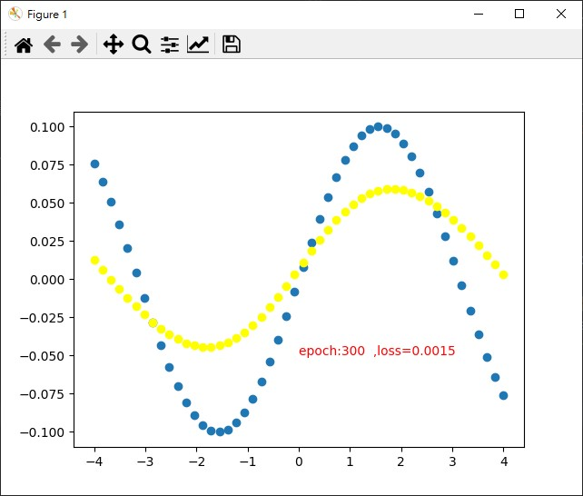

# Train On Batch 

6.TensorFlow_Train_On_Batch

跟fit一樣都是用來訓練模組，可以當作是分段訓練，請選擇其中一個訓練方式即可。

分段的優點:

+  更精細的設定訓練過程，更精準的收集Loss & Metrics。
+  多GPU訓練保存模型更方便。
+  多種的資料加載方式，可以結合Torch使用。


分段的概念也可以想成fit加上Callback。

<br/>

## 基本使用方式
```python
for step in range(2000):
    cost = model.train_on_batch(x_train, y_train)  
    print("[loss,acc]",cost)    #顯示訓練結果
```

## 保存模型

```pyhton
for step in range(2000):
    cost = model.train_on_batch(x_train, y_train2,)
    if step % 20 == 0:  #20次訓練分段        
        #保存模型架構
        with open("model.json", "w") as json_file:
           json_file.write(model.to_json())
        #保存模型權重
        model.save_weights("model.h5")
```

## 動態圖表觀察

```python
for step in range(8001):    #進行8001次訓練
    cost = model.train_on_batch(x_train, y_train)  #指定變數，會得到[loss,acc]
    if step % 100 == 0: #每一百次更新圖表
        W, b = model.layers[0].get_weights()    #取得參數 權重、閾值

        print("step{} Weights = {}, bias = {} train cost{}".format(step,W, b, cost))

        plt.cla()           #清空plt
        plt.scatter(X, Y)   # 化新的散佈圖

        #預測
        Y_pred2 = model.predict(X)
        plt.scatter(X, Y_pred2,color="yellow") #當前預測散佈圖

        #在圖上寫字
        plt.text(0, -0.05, 'epoch:%d  ,loss=%.4f ' % (step,cost[0]),
                 fontdict={'size': 10, 'color': 'red'})

        plt.pause(0.1)
```

透過動態圖表觀察，可以看到預測數據會越來越準確。

