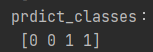

# MLP 類神經網路 快速上手!

_參照code：3.TensorFlow_MLP.py_


開發人工智慧跟使用機器學習整體上感覺差不多，但就多了一些要注意的步驟。

## 1. 資料準備
一樣是準備特徵值與標籤答案，永遠記得，資料越多關聯性越強，成效越佳。

這裡用亂數產生訓練用資料，低於500的特徵答案為0，高於的答案為1。
```python
x1=np.random.random((500,1))  #產生五百筆 0~1的資料。
x2=np.random.random((500,1))+1  #同上，產生完後全部+1，所以會是1~2。
x_train=np.concatenate((x1, x2))  #資料串起來。

y1=np.zeros((500,), dtype=int)  #產生五百筆 0 的資料
y2=np.ones((500,), dtype=int)   #產生五百筆 1
y_train=np.concatenate((y1, y2))  #也是把資料串起來
```
---
## 2.建立模型
簡單說就是宣告、初始化的動作。

要對付甚麼樣的資料，就用甚麼樣的演算法。

+ MLP：分類與回歸，處理能丟進Excel的資料，又稱DNN、NN，中文叫做類神經。
+ CNN：CNN有很多個方法，Yolo、VGG16、VG119、ResNet，主要處理多維度資料，例如：圖像、聲音、2D、3D。
+ LSTM、RNN：主要處理與時間相關、股票。LSTM(Long Short Time Memory)
+ GAN：G=對抗、A=判斷、N=類神經，當資料不足時會透過亂數產生。

建立模型有一個重點，就是需要決定類神經的節點，起點特徵值與終點答案的參數不能亂填，程式會出錯。

```python
#建立模型
model = tf.keras.models.Sequential([
  tf.keras.layers.Dense(5, activation=tf.nn.relu, input_dim=1), #input_dim=特徵數
  tf.keras.layers.Dense(5, activation=tf.nn.relu),
  tf.keras.layers.Dense(2, activation=tf.nn.softmax)  #第一個參數2=答案類別數。
])
```
建構子的地方可以發現是一個List型別，所以其實也能換一個寫法。

```python
# 建立模型
model = tf.keras.Sequential()

# 用像list增加的方式，一個一個加上去。
model.add(tf.keras.layers.Dense(units=10,
                 activation=tf.nn.relu,    #tf.nn.relu
                 input_dim=1))
model.add(tf.keras.layers.Dense(units=10,
                 activation=tf.nn.relu ))  # tf.nn.relu
model.add(tf.keras.layers.Dense(units=2,
                 activation=tf.nn.softmax ))  #tf.nn.softmax
```

可以將tf.keras.layers.Dense()想像成一個區塊，units就是該區塊有多少個路徑點，input_dim則是有多少特徵值，input_dim只能用在第一個區塊上，最後一個區塊的units要等於答案的種類數量，激勵函式也有點不同，這點要注意。


---

## 3.編譯
編譯這個動作也稱「最短路徑」或是「最佳化」，可以設定模型在深度學習時找出最多正確的答案。

編譯中三個重要參數
### 1. optimizer='adam'
   指定adam演算法找出最佳答案，也就是在每次搜尋的時候依照該演算法找出最靠近100%結果的目標。

### 2. loss='sparse_categorical_crossentropy'
用「稀疏分類別交叉熵」演算法處理損失率，損失率是用來估量模
型的預測答案與實際答案之間的差異程度，可想成準確率。

### 3. metrics=['accuracy']
設定編譯時的目標，這裡是以準確率為主要目的。


```python
model.compile(optimizer='adam',
              loss='sparse_categorical_crossentropy',
              metrics=['accuracy'])
```

---

## 4.訓練
訓練這點也跟機器學習一樣，但多了一些方法讓訓練達到更好效果。
訓練裡能放入四個建構子，除了基本的X、Y以外還有
+ epochs：設定訓練次數。
+ batch_size：每次訓練數量，意思就是每次訓練時資料會幾筆幾筆的學。

以上這兩個值，調整會對預測準確率有影響，厲害的人工智慧就是要把預測做到最精準，所以懂得調整這兩個值非常重要，epochs越高有益、batch_size越低有益，後續會有如何調整的教學。
```python
model.fit(x_train, y_train,
          epochs=10,
          batch_size=50)  #batch_size 如果不塞 他就是自動預設
```
訓練時會輸出訓練狀況，Loss是指損失率，也就是與預測值的差距，Acc指權重，可以當作正確率來看。

這是另外補充的函式，不用加上print就會顯示出類神經的過程，也就是一堆神經原的圖片。
```python
model.summary()
```
---

## 5.測試
這裡會使用evaluate()函式找出「權重weight」的正確率。

精準度越高，權重越大，詳細可以查維基百科。

簡而言之，這個函式可以算出損失率與正確率

```python
x_test=np.array([[0.22],[0.31],[1.22],[1.33]])  #準備測試資料
y_test=np.array([0,0,1,1])

score = model.evaluate(x_test, y_test, batch_size=128)      #測試特徵、測試答案、單次評估數量。
print("score:",score)   #score: [0.26251232624053955, 1.0]
```

可以透過改變訓練的次數與單次資料數，來改善資料的正確率。

---

## 6.預測

人工智慧的預測跟機器學習稍有不同，主要是依靠兩個函式。
+ model.predict(x_test)
  
  sklearn的predict是預測結果，但這裡是預測出每一個結果的機率！

  

+ model.predict_classes(x_test)

  這方法跟Sklearn的predict一樣，會直接輸出答案

  