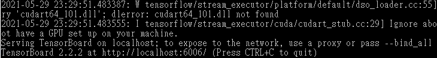
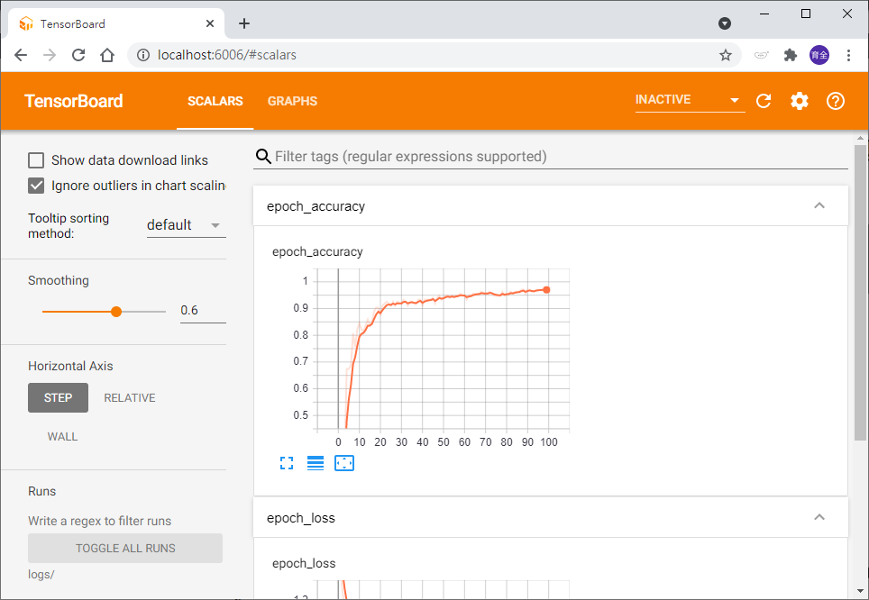

# TensorBoard

_參照code：1.TensorFlow_Board.py_


TensorBoard是個很厲害的功能，在使用TensorFlow計算時，可以透過TensorBoard將訓練過程與模型關係做圖形化，讓此更好理解與調整。

安裝pip

>pip install Tensorboard

安裝完pip後可以在cmd中輸入指令。

>tensorboard

這個指令可能會出現錯誤，但沒關係，重點是要知道有無安裝成功，只要不是找不到指令即可。

引用pip的部分比較特別，是要從TensorFlow的函式庫裡import。

```python
from tensorflow.keras.callbacks import TensorBoard
```

使用TensorBoard的重點在訓練的時候，要先宣告一個主體，訓練時代入參數，會在每一次訓練做儲存的動作。

宣告的時候要代入一個資料夾名稱的參數，執行Code會在該資料夾目錄存下log。
```python
#宣告TensorBoard
tensorboard=TensorBoard(log_dir="logs") #把los檔案存在當前檔案路徑下。

#訓練
history=model.fit(X_Train,Y_Train2,
                  epochs=100,
                  batch_size=20,
                  callbacks=[tensorboard],  #每次訓練儲存log
                  verbose=4)    #處理時的資訊顯示
```

執行完後會發現目錄下多了一個logs資料夾，再來開始cmd視窗，輸入指令。

個人會習慣先CD到路徑下，執行時的路徑用相對路徑，方便！

>tensorboard --logdir=logs/ 

執行時可能要稍微等待，完成後會看到一條localhost的網址。



將網址貼上瀏覽器後就可以看到美美的TensorBoard。



在上面選單的GRAPH可以看到類神經的過程，右上的按鈕也有說明可以看，這裡就不多做補充了。


