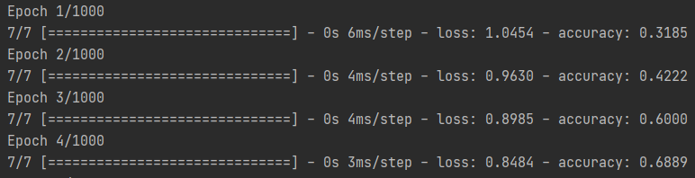
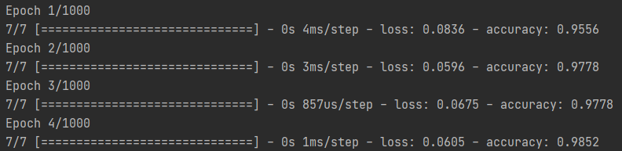

# 利用CallBacks隨時儲存

如果訓練過程又臭又長，還怕電腦當機，或是可能有其他因素導致訓練中斷，那可以使用這個方式。

訓練時使用Callbacks可以做到每次訊練儲存一次模型的效果，也就是邊訓練邊儲存。

訓練前，要先宣告一個每次儲存使用的變數。

先解釋一下官方給的函式。
```python
tf.keras.callbacks.ModelCheckpoint(
    filepath,
    monitor='val_loss',
    verbose=0,
    save_best_only=False,
    save_weights_only=False,
    mode='auto',
    period=1)
```

+ filepath ： 存檔路徑。
+ monitor ： 監測數據。
+ verbose ： 1=詳細訊息、0=簡易訊息。
+ save_best_only ： 為True的時候，最佳模型不會被覆蓋。
+ mode ： 參數有 auto、min、max，詳細待補。
+ save_weights_only ： 為True時，只有權重會被保存、False會保存整個模型。
+ period ： 每次儲存的間隔，也就是每幾次訓練做一次儲存。

使用的時候用個變數包裝，比較乾淨整潔。
```python
check_Point=tf.keras.callbacks.ModelCheckpoint(
    "model.h5",monitor='loss',
    save_best_only=True,mode='auto',period=1)
```

在訓練時使用callbacks呼叫這個變數。

```python
history=model.fit(X_Train,Y_Train2,
                  epochs=1000,
                  batch_size=20,
                  callbacks=[check_Point])
```

<br/>
<br/>

# 分批訓練

沿用剛剛的程式碼，可以進行重新讀取權重再次訓練，也可以利用這種方式做到分批訓練，把訓練資料切分成多份，分批次進行訓練，減少不必要的麻煩。

這裡沒有使用新的函式庫跟方法，只是個概念應用，雖然聽起來很普通，但卻是一個非常重要的技巧，請務必學會且記得。

可以把功能簡單切成兩個部分，一是讀取儲存好的模型，二是讀取失敗就建立新模型。

根據敘述就知道可以使用Try做到這個功能。

```python
try:    #用Try包裝，讀取失敗就改成建立新模型。
    #讀取架構
    with open('model_callbacksSave.json', 'r') as f:
        model = model_from_json(f.read())
    #讀取權重
    model.load_weights('model_callbacksSave.h5')

    model.compile(optimizer=tf.keras.optimizers.Adam(lr=0.001),
                  loss=tf.keras.losses.categorical_crossentropy,
                  metrics=['accuracy'])
```

當讀不到模型時執行，這裡用了 except IOError 只有在資料流出錯的時候才會進到這裡，其他錯誤會跳出程式報錯。

記得一定要儲存模型架構，不然下次又會在建立新的。

```python
except IOError: #在發生讀取失敗才進到此處。
    #建立新模型
    model=tf.keras.models.Sequential([
        tf.keras.layers.Dense(units=20,activation=tf.nn.relu,input_dim=dim),
        tf.keras.layers.Dense(units=40,activation=tf.nn.relu),
        tf.keras.layers.Dense(units=category,activation=tf.nn.softmax)
    ])

    #編譯
    model.compile(optimizer=tf.keras.optimizers.Adam(lr=0.001),
                  loss=tf.keras.losses.categorical_crossentropy,
                  metrics=['accuracy'])
    # 儲存模型架構
    with open('model_callbacksSave.json', 'w') as f:
        f.write(model.to_json())
```


重新訓練。

```python
#儲存模型權重

check_Point=tf.keras.callbacks.ModelCheckpoint(
    "model_callbacksSave.h5",monitor='loss',
    save_best_only=True,mode='auto',period=1)


#訓練
history=model.fit(X_Train,Y_Train2,
                  epochs=1000,
                  batch_size=20,
                  callbacks=[check_Point,])

#測試
score=model.evaluate(X_Test,Y_Test2,batch_size=20)
print("score:",score)
```

經過多次停止、重新訓練，可以發現後續的訓練準確率會從前一次最後的結果開始。

第一次訓練。



第二次訓練。

