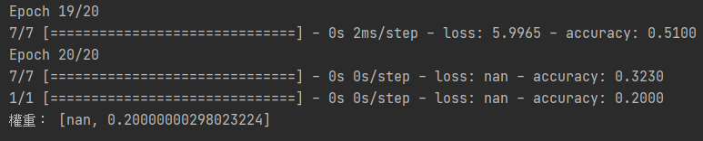
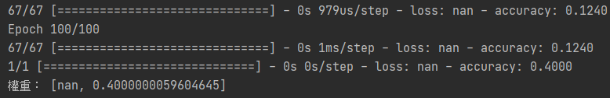

# 改善與調整結果

_參照code：6.TensorFlow_Fine-Tune.py_


厲害的人工智慧工程師會經由調整來改善預測結果跟準確性，這裡會有幾個調整MLP的技巧。

## 資料準備

先準備一個比較複雜的訓練與測試資料，寫成函式包起來。

```python
def CreateDatasets(high,iNum,iArraySize):
    x_train = np.random.random((iNum, iArraySize)) * float(high)
    y_train = ((x_train[:iNum,0]+x_train[:iNum,1])/2).astype(int)
    return x_train, y_train,tf.keras.utils.to_categorical(y_train, num_classes=(high))
```

恩...這樣寫法看起來很複雜，我們換個方式，修改一下變數名稱。

```python
#產生資料集
def CreateDatasets(Category,Amount,Dimension):
    #測試特徵
    x_list = np.random.random((Amount, Dimension)) * Category    #建立好維度，乘上分類大小。

    #測試標籤
    y_list = ((x_train[:,0]+x_train[:,1])/2).astype(int)       #將兩個特徵值平均後，取整數(轉int取整)。

    #測試答案-向量化
    y_list2=tf.keras.utils.to_categorical(y_train, num_classes=(Category)) #記得最後一個建構子不要亂填。

    #回傳
    return x_list, y_list,y_list2
```


這裡我們產生2個特徵，25筆資料的特徵測試集，與4種答案的標籤測試集。

```python
#資料設定
category=2  #答案的種類數，也會決定特徵的最大數值
dimension=2 #特徵數

#呼叫函式
x_train,y_train,y_train2=CreateDatasets(category,1000,dimension)
```

接下來依照正常的訓練及測試過程。

+ 準備了1000份資料
+ 兩個隱藏層，各有10個節點
```python
units_Base=1
#建立模型
model=tf.keras.models.Sequential([
    tf.keras.layers.Dense(units=10*units_Base,activation=tf.nn.relu,input_dim=dimension),
    tf.keras.layers.Dense(units=10*units_Base,activation=tf.nn.relu),
    tf.keras.layers.Dense(units=category,activation=tf.nn.relu),
])

#編譯
model.compile(optimizer='adam',
              loss=tf.keras.losses.categorical_crossentropy,
              metrics=['accuracy'])
```

+ 20次訓練，每次訓練150筆
```python
#訓練
epochs_Base=2
model.fit(x_train,y_train2,epochs=10*epochs_Base,batch_size=150)

#測試
x_test,y_test,y_test2=CreateDatasets(category,10,dimension) #產生測試用資料集
score= model.evaluate(x_test,y_test2,batch_size=50)
print('權重：',score)
```

經過訓練，會發現準確率非常糟糕，爛得要死。


<br/>
<br/>
<br/>

# 基本上有五個調整技巧

## 1. 增加訓練次數
讓模組多訓練、瘋狂訓練，那預測的準確度也會相對增加，就像經驗老道的員工一樣。


## 2. 調整單次訓練筆數
調整越小的話訓練次數會越多，準確率也越高，但建議大小是在答案種類的5~10倍，最好要讓每次的訓練都有出現不同的答案，不然訓練會變得沒有意義。


## 3. 增加神經元
增加神經元可以讓特徵值有更好的區分與描述細節，但有一個重點，神經元不能越來越少，否則特徵值會被消滅。

## 4. 增加隱藏層
隱藏層數量沒有上限，適當的添加可以讓模組有更多的轉換空間去找出資料的特徵。

## 5. 增加訓練資料
資料蒐集越多、關聯性越強那機器學習跟人工智慧預測出的效果會越好！


這裡來嘗試一下
+ 訓練次數提升到100次。
+ 單筆訓練20筆。
+ 單層神經元加到100顆。
+ 隱藏層改為四層。
+ 訓練資料增加到2000筆。

雖然這樣看起來準確度還是很低，但還是能發現結果比剛剛還好，建議多測幾次取平均值。
