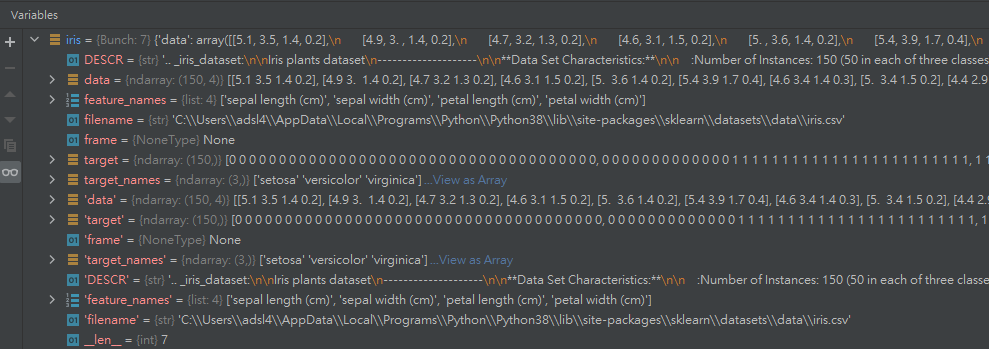

# 鳶尾花練習


_參照code：7.TensorFlow_Example_Flower.py_

這裡使用sklearn附設的鳶尾花資料集做練習。

<br/>

## 資料準備

要準備資料的時候，先把資料讀起來，看看裡面長甚麼樣子。

```python
from sklearn import datasets
iris=datasets.load_iris()
```

善用Debug，問題不求人。


可以看到有四個特徵值，三個答案種類，但程式設計師不會笨笨的直接打出數字，善加利用方法函式才是厲害的做法。

```python
dim=len(iris.feature_names) #取得特徵數
print('特徵數：',dim)   #特徵數： 4
category=len(iris.target_names) #取得答案種類
print('答案數：',category)  #答案數： 3
```

因為鳶尾花本身的資料量已經很少了，故訓練資料要分大一點，測試用少一點無所謂。
```python
x_train,x_test,y_train,y_test=train_test_split(iris.data,iris.target,test_size=0.1)
```

資料切割完，順手做個向量化，是為了要用獨熱編碼。
```python
y_train2=tf.keras.utils.to_categorical(y_train,num_classes=category)
y_test2=tf.keras.utils.to_categorical(y_test,num_classes=category)
```

## 建立模型

每一隱藏層的神經元都設定為前一層的1.5倍，最後效果會好很多，如果測試結果不如意，還可以再進行調整或是多加隱藏層。
```python
model=tf.keras.models.Sequential([
    tf.keras.layers.Dense(6,activation=tf.nn.relu,input_dim=dim),
    tf.keras.layers.Dense(9,activation=tf.nn.relu),
    tf.keras.layers.Dense(14,activation=tf.nn.relu),
    tf.keras.layers.Dense(category,activation=tf.nn.softmax)
])
```

## 編譯

獨熱編碼再編譯時，要注意loss的參數不要給錯。
```python
model.compile(optimizer='adam',
              loss=tf.keras.losses.categorical_crossentropy,
              metrics=['accuracy'])
```

## 訓練

訓練次數不要寒酸，100筆已經是很收斂了，單次訓練筆數調整為答案數的五倍是比較良好的做法。
```python
model.fit(x_train,y_train2,epochs=100,batch_size=20)
```

## 測試

隨手測試了三次，效果都非常良好！
```python
score=model.evaluate(x_test,y_test2,batch_size=20)
print("權重：",score)

#權重： [0.11891574412584305, 1.0]
#權重： [0.1936449110507965, 1.0]
#權重： [0.06030178442597389, 1.0]
```

## 預測
實際預測答案也非常正確，這樣就是一個良好的人工智慧模組。
```python
predict_class=model.predict_classes(x_test)
print('前十筆測試答案：',y_test[:10])           #前十筆測試答案： [1 2 2 1 2 0 0 1 1 2]
print('前十筆預測答案：',predict_class[:10])    #前十筆預測答案： [1 2 2 1 2 0 0 1 1 2]
```