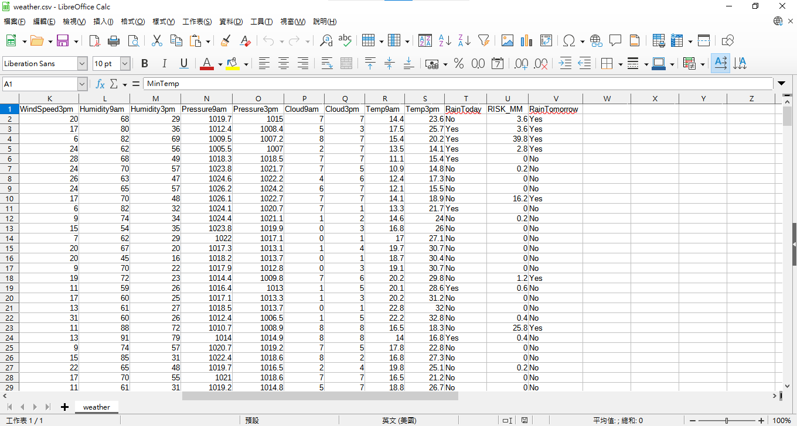
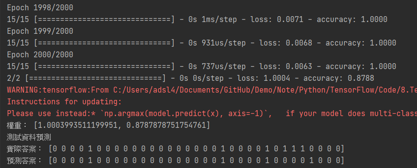

# 天氣預測練習

這次換試試天氣預測，資料使用澳洲Canberra的Open Data做練習，資料來源為[Australian Government](http://www.bom.gov.au/act/forecasts/canberra.shtml。)

<br/>
<br/>
<br/>

# 檢視資料

_參照code：Wheater_CsvToExcel.py_

_參照csv：weather.csv_

檔案下載回來後是一個CSV檔，仔細看看適合當答案的有「RainToday」、「RainTomorrow」，但答案內容是Yes跟no，這個數值不方便我們做人工智慧的訓練，所以要做一些調整，在調整上建議轉excel檔案，會比較方便快速。



對於強大的Pandas來說，做很多繁雜的動作往往都是一兩行Code就結束的事情，這裡用map方法把Yes跟No轉成1跟0，個人有點潔癖不喜歡動到原本資料所以額外加上新的欄位。

個人習慣會把這個功能獨立成一支程式，做法很多種，也可以讀取修改後不要儲存直接拿來訓練。

這裡注意一點，做訓練的資料盡量不要有空值，不然訓練出來的結果權重都會變得很弔詭，其他程式碼的部分就不贅述了。

```python
import pandas as pd
from pandas import ExcelWriter

csv_Dataframe=pd.read_csv('weather.csv')    #讀取CSV

csv_Dataframe.dropna(axis=0, how='any', inplace=True)   #刪除有空值的列

replace_dict={'Yes':'1',"No":"0"}   #替換答案用的Dictionary

#替換至新欄位
csv_Dataframe['TodayLabel']=csv_Dataframe['RainToday'].map(replace_dict)
csv_Dataframe['TomorrowLabel']=csv_Dataframe['RainTomorrow'].map(replace_dict)

#存成xls
writer = ExcelWriter('weather.xlsx', engine='xlsxwriter')   #塞檔案用的變數
csv_Dataframe.to_excel(writer, sheet_name='weather',index=False) #寫入變數，index刪掉，他很煩。
writer.save()   #存檔
```

<br/>
<br/>
<br/>

# MLP

_參照code：8.TensorFlow_Example2_Weather.py_


程式碼冗長，故只講述重點部分。

這次取用了14個特徵值做預測，特徵值不一定要這麼多，可以的話取關聯性高的最好。

再三強調，特徵值要注意有沒有奇怪的值，比如文字、空值。


|欄位名稱|中文對照|
|:---:|:---:|
|MinTemp|最低溫|
|MaxTemp|最高溫|
|Sunshine|陽光|
|WindGustSpeed|陣風|
|WindSpeed9am|上午9點的風速|
|WindSpeed3pm|下午3點的風速|
|Humidity9am|上午9點的溼度|
|Humidity3pm|下午3點的溼度|
|Pressure9am|上午9點的大氣壓力|
|Pressure3pm|下午3點的大氣壓力|
|Cloud9am|上午9點的雲量|
|Cloud3pm|下午3點的雲量|
|Temp9am|上午9點的氣溫|
|Temp3pm|下午3點的氣溫|

<br/>
<br/>


這裡讀取資料來源，如果是xlsx檔要注意可能需要安裝PIP openpyxl 函式庫。
```python
data=pd.read_excel('weather.xlsx',0)
```

由於是利用pandas讀取，必須再轉回陣列，使用to_numpy方法，方便又快速。

```python

#取特徵值的欄位，順便轉Numpy，會形成二維資料。
featrues_list=['MinTemp','MaxTemp','Sunshine','WindGustSpeed','WindSpeed9am','WindSpeed3pm',
               'Humidity9am','Humidity3pm','Pressure9am','Pressure3pm',
               'Cloud9am','Cloud3pm','Temp9am','Temp3pm']
featrues=data[featrues_list].to_numpy()

#標籤答案，讀取時順便轉numpy，還會轉成一維。
today_Label=data['TodayLabel'].to_numpy()
tomorrow_Label=data['TomorrowLabel'].to_numpy()

#特徵數與答案種類
category=2
dim= len(featrues_list)
```

資料分割完，順手做個獨熱編碼。

不在分割前做向量化的原因，是因為後續會拿來Print做比對，如果顯示出向量化的資料，出來的視覺效果會比較差。

```python
#這裡示範預測隔天天氣。
x_train,x_test,y_train,y_test=train_test_split(featrues,tomorrow_Label,test_size=0.1)  #切割

#向量化
y_train2=tf.keras.utils.to_categorical(y_train,num_classes=category)
y_test2=tf.keras.utils.to_categorical(y_test,num_classes=category)
```

接下來的建立、編譯、訓練、測試、預測步驟都一樣，只要自己慢慢的將訓練用的參數做微調，並把結果調教至最好即可。


