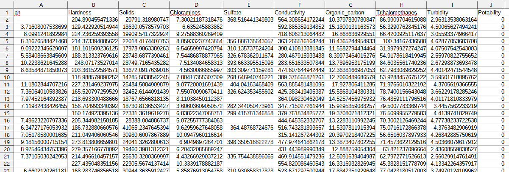

# 水質檢測練習

_參照code：9.TensorFlow_Example3_Water.py_

_參照csv：water_potability.csv_


練習使用Kaggle上找到的水質檢測數據，連結在此[Water Quality](https://www.kaggle.com/adityakadiwal/water-potability)。

拿到檔案的時候一樣先打開來看。



可以發現空值非常多，實際有空值的筆數高達一千筆，這時候有三種解決方式，沒有一定好的方法，請斟酌。

+ 刪除有空值的資料
  
  這是最簡單的作法，但也不算是個好方法，空值資料占了三分之一，如果都刪除的話資料量會太少。
  ```python
  dataframe=dataframe.dropna()    #刪除空值
  ```

+ 放入特殊值 -1
  
  比較推薦的好方法，比放0還更適合，如果需要做均一化，則避免使用這個方法。
  ```python
  dataframe=dataframe.fillna(-1)  #填滿空值為-1
  ```

+ 放入平均值
  
  這方式會放入該欄位的平均值，一般情況下不太建議用這個方法，但如果要使用均一化的時候，這算是不錯的解決方案。
  ```python
  dataframe=dataframe.fillna(df.mean())  #填滿空值為平均值
  ```

稍微觀察一下還可以發現，每個特徵值的最高最低數據差異非常大，這時候就非常建議做均一化的動作，這會讓預測準確度變高。

既然使用了均一化那空值的部分就推薦使用第三個解決方案。

```python
#均一化
dataframe=((dataframe-dataframe.min())/(dataframe.max()-dataframe.min()))
```

把資料整理完之後，就可以開始準備訓練與測試用資料了。

我的習慣會讓特徵值的欄位獨立成一個list，用變數承載特徵數時比較方便，看起來也比較漂亮。
```python
#特徵值
features_List=['ph','Hardness','Solids','Chloramines',
             'Sulfate','Conductivity','Organic_carbon',
             'Trihalomethanes','Turbidity']
x=dataframe[features_List]

#答案
y=dataframe['Potability']

#要轉成numpy的陣列。
x=x.to_numpy()
y=y.to_numpy()

category= len(np.unique(y))
dim= len(features_List)
```

資料很少，一樣切0.1就好，記得要向量化，獨熱編碼基本上必做。
```python
#資料切割
X_Train,X_Test,Y_Train,Y_Test=train_test_split(x,y,test_size=0.1)

#向量化
Y_Train2=tf.keras.utils.to_categorical(Y_Train,num_classes=category)
Y_Test2=tf.keras.utils.to_categorical(Y_Test,num_classes=category)
```
順手作個KNN模組，可以比對一下人工智慧根機器學習的差異性。

```python
knn=KNeighborsClassifier()
knn.fit(X_Train,Y_Train)

print('預測：',knn.predict(X_Test)[:10])
print('實際：',Y_Test[:10])
print('準確率： %.2f' % knn.score(X_Test,Y_Test))
```

隱藏層跟神經元就自行調整，詳細說明其他文章內會有，神經元個人習慣每層多一倍，太多實在做不出甚麼差異性，也未必更佳。

```python
#建立模型
model=tf.keras.models.Sequential([
    tf.keras.layers.Dense(units=dim*2,activation=tf.nn.relu,input_dim=dim),
    tf.keras.layers.Dense(units=dim*3,activation=tf.nn.relu),
    tf.keras.layers.Dense(units=dim*4,activation=tf.nn.relu),
    tf.keras.layers.Dense(units=category,activation=tf.nn.softmax),
])


#編譯
model.compile(optimizer='adam',
    loss=tf.keras.losses.categorical_crossentropy,
    metrics=['accuracy'])

#訓練
model.fit(X_Train, Y_Train2,
          epochs=50,
          batch_size=20)


#測試
model.summary()
score = model.evaluate(X_Test, Y_Test2 )
print("score:",score)

predict2 = model.predict_classes(X_Test)
print("predict_classes:",predict2[:10])
print("y_test",Y_Test[:10])

```
