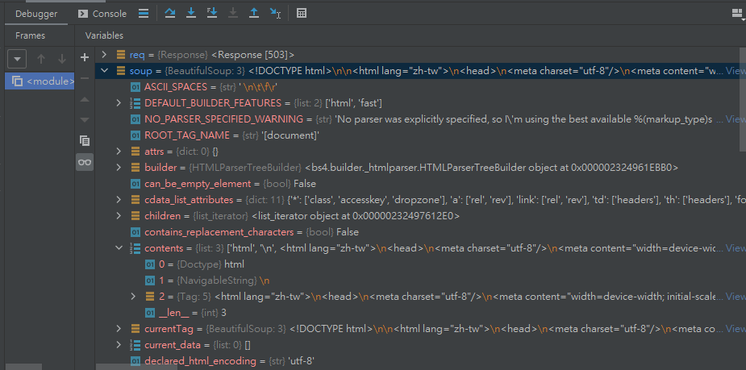

# Web Crawler 網路爬蟲
網路爬蟲又稱網路蜘蛛(spider)，意旨透過程式抓取網頁上的資料。

Python需要用到兩個第三方函式庫。

主要是 美人湯(BeautifulSoup)，用於搜尋標籤。
>pip install BeautifulSoup4

也會用到 Requests，取得網頁回應資料。
>pip install requsets

<br/>
<br/>

# 美人湯函數、屬性運用。

_參照code：1.WebCrawler.py_<br/>

引用方式
```python
import requests
#美人湯的引用方法較為不一樣
from bs4 import BeautifulSoup
```

以PTT作為爬蟲對象來實作範例。
```python
#取得網頁回應
req=requests.get('https://www.ptt.cc/bbs/index.html')

#宣告美人湯主體
#取得的回應內容(req.text)依照情況轉編碼。
soup=BeautifulSoup(req.text.encode('utf-8'),'html.parser')
```

## soup.Title
&emsp; 取得網站Title
```python
print(soup.title)   #<title>熱門看板 - 批踢踢實業坊</title>
```

## string
&emsp; 取得內容。
```python
#取得標題內的文字(不會包含HTML標籤)
print(soup.title.string)    #熱門看板 - 批踢踢實業坊
```

## parent
&emsp; 取得目前節點的父類，即上一層的意思。
```python
print(soup.title.parent)    #<head>....省略....</head>
```

## name
&emsp; 取得標籤名稱
```python
print(soup.title.parent.name)   #head
```

## p
&emsp; 取得第一個\<p>標籤。
```python
print(soup.p)   #<p data-translate="turn_on_cookies" style="color:#bd2426;">....省略....</p>
```

## a
&emsp; 取得第一個\<a>標籤。
```python
print(soup.a)   #<a href="mailto:webmaster@gamer.com.tw">webmaster@gamer.com.tw</a>
```

## get('x')
&emsp; 取得該標籤內的x屬性
```python
print(soup.p.get('data-translate'))   #turn_on_cookies
```


## p['x']
&emsp; 取得標籤內x屬性的值，x為標籤的屬性名稱。使用與GET一樣
```python
print(soup.p['style'])          #color:#bd2426;
```
其他標籤也能這樣使用
```python
print(soup.a['href'])   #mailto:webmaster@gamer.com.tw
```

## find_all('x')
&emsp; 找所有x標籤，回傳為list。
```python
print(soup.find_all('a'))   #回傳值為list。
```

## select(x)
&emsp; 找所有x標籤，回傳為list，跟find_all有異曲同工之妙。
```python
print(soup.select('p')) #回傳list
```
## select還可以尋找屬性值符合的標籤。

加上點(.)可以尋找Class屬性。
```python
soup.select('.value')   #故這裡會找到class='value'的標籤
```

加上井字(#)可以尋找id屬性。

id屬性在HTML中有唯一性，所以ID是最好的搜尋指標。
```python
soup.select('#name')    #故這裡會找到id='name'
```
## contents
&emsp; 取得目前節點中，依照HTML標籤所切割的內容，contents本身為list型態。
```python
print(soup.a.contents)  #['webmaster@gamer.com.tw']
```
利用美人湯處理過的HTML會變得一層一層的型態，可以用Debug去找想取得的值，可以不用太過於死背。



