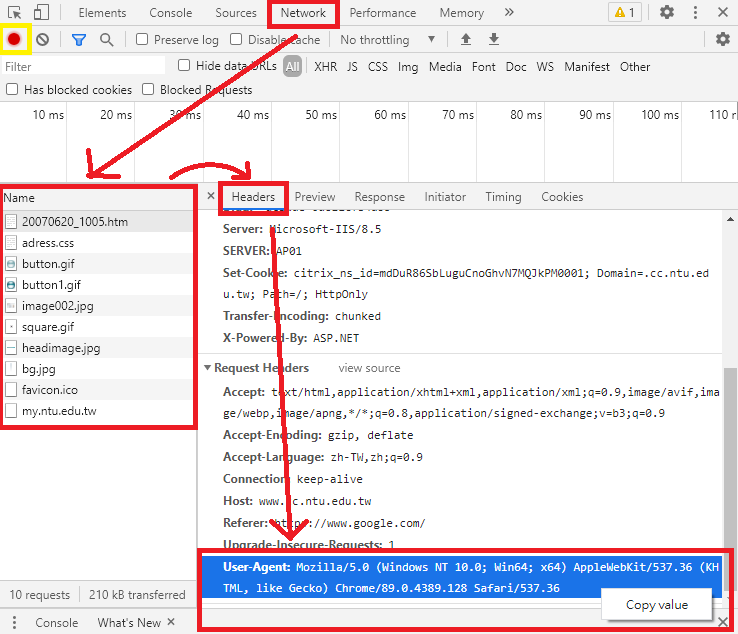
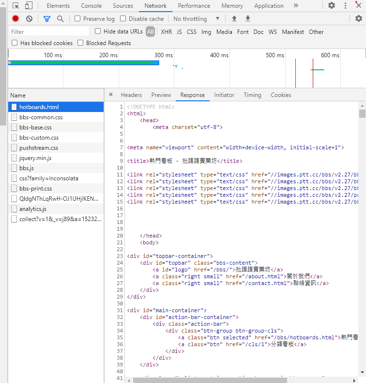

# Web2.0 爬蟲
_參照code：3.WebCrawler_Web2.py_<br/>

很多網站都會有防爬蟲的措施，比如偵測是否為瀏覽器。

可以透過更改Header讓讓網站以為是瀏覽器。

使用Google Chrome的開發者工具(F12)，確認目前為錄影狀態(黃框)，選取 network 中任意一個檔案，在選取Headers欄位，最下方Request Header內的 User-Agent屬性就是我們要的東西，按右鍵可以複製值。




在請求網頁回應時，加上更改的Header。
```python
headers = {'User-Agent':'Mozilla/5.0 (Windows NT 10.0; Win64; x64) AppleWebKit/537.36 (KHTML, like Gecko) Chrome/89.0.4389.128 Safari/537.36'}
req = requests.get(url, headers=headers)
```


以PTT作為範例目標，在Network裡尋找需要爬蟲的資料，點兩下會開啟新頁面，即可得到該網址。



爬蟲最重要的是，只要了解該網站的HTML架構，找到自己想要爬得的資料。


