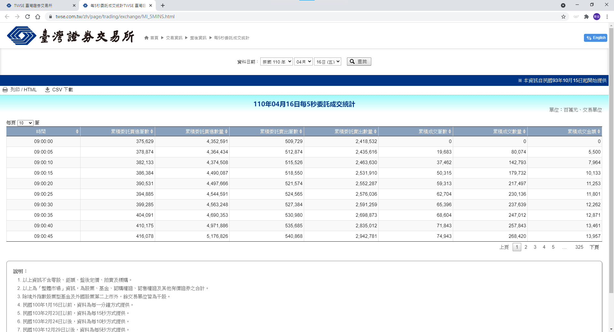
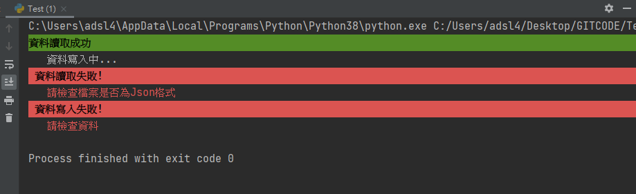

# 台灣證交所-每五秒委託成交統計

_參照code：4.WebCrawler_TWSE_Exam_1.py_<br/>

程式功能
+ 抓取台灣證交所的每五秒委託成交統計
+ 存檔成excel格式

尚未實現
+ 存入Database
+ excel依照時間分成不同表

---

## Step.1

爬蟲的第一件事，先找到自己需要的檔案。

頁面上看起來只有收到部分資料，該網頁原始碼也是如此，於是我從開發者工具內的Network找到了單獨放所有資料的檔案。


---

## Step.2

有了資料的URL就可以撰寫向網頁請求資料的CODE。

```python
#台灣證交所-每五秒委託成交
url = 'https://www.twse.com.tw/exchangeReport/MI_5MINS?response=json&date=&_=1618676468726'

#模擬瀏覽器
headers = {'User-Agent':'Mozilla/5.0 (Windows NT 10.0; Win64; x64) AppleWebKit/537.36 (KHTML, like Gecko) Chrome/89.0.4389.128 Safari/537.36'}
#請求資料
req = requests.get(url, headers=headers)
```

---

## Step.3

確認收到資料後，發現資料使用json格式，於是用json函式庫讀取，絕對比美人湯適合。

```python
json_Data=json.loads(req.text)
```

宣告excel主體。
```python
#取得標題作為檔案名稱
xml_Name=json_Data['title']

#宣告excel檔
xml_Wb=xlwt.Workbook()
#建立新表
sheet=xml_Wb.add_sheet(xml_Name)
```

排版寫入資料，需要指定欄與列，宣告兩個變數作為索引。
```python
col_index=0
row_index=0
```

第一列先寫入欄位名稱。
```python
for col in json_Data['fields']:
    sheet.write(row_index,col_index,col)    
    col_index=col_index+1   #每一格寫完都要跳下一格索引

# 寫完記得索引至下一行
row_index=row_index+1
```
開始寫入資料
```python
for row in json_Data['data']:

    col_index=0 #每一行寫完索引歸0

    for value in row:
        sheet.write(row_index,col_index,value)
        col_index=col_index+1

    row_index = row_index + 1
```
資料中有NOTE的部分，也加上去。
```python    
row_index=row_index+2   #區隔兩行，排版較好看
for note in json_Data['notes']:
    sheet.write(row_index,0,note)
    row_index = row_index + 1
```

資料都寫入完成之後，就可以正式把excel做存檔了，檔案名稱順手加上副檔名，否則存好的檔案要開啟還要另為指定開啟方式。
```python
#檔案名稱加上副檔名
xml_Name = xml_Name + ".xls"

#Excel存檔
xml_Wb.save(xml_Name)
```
---

## Step.4
程式都寫完以後，執行完全沒有顯示介面，看起來特別無聊，於是加上print讓程式有作動的感覺。

我替print做了一些上色美化。



(Print演示)