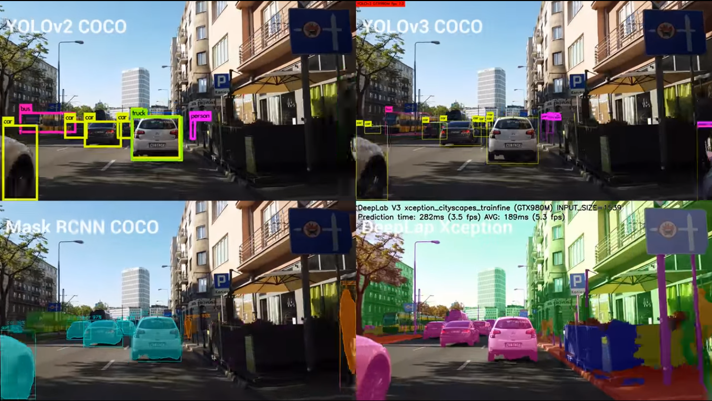

# YOLO

You Only Look Once的縮寫。

做影像辨識時離不開的四樣東西。

+ YOLOv2
+ YOLOv3
+ Mask RCNN
+ Deeplap

效果差異

圖片來源 youtube：[YOLOv2 vs YOLOv3 vs Mask RCNN vs Deeplab Xception
](https://www.youtube.com/watch?v=s8Ui_kV9dhw)

 
 
 

YOLO的技巧是將畫面切成多個小區域，並進行預測。

圖片來源：[YOLO object detection with OpenCV](https://www.pyimagesearch.com/2018/11/12/yolo-object-detection-with-opencv/)
 
 

# C O C O

COCO = microsoft COCO

COCO有33萬張圖片作為特徵，超過二十萬個種類。

