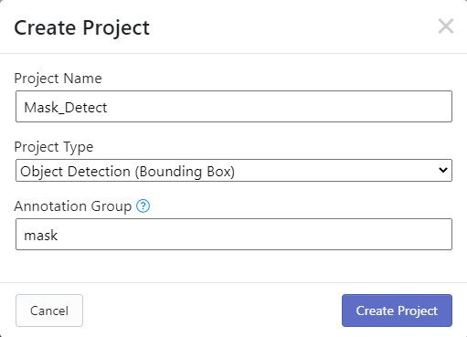

# Roboflow

_註 : kaggle跟Roboflow都需要申辦帳號。_

透過roboflow可以訓練權重給yolo使用。

先去Kaggle尋找想要訓練的主體，這裡以口罩做為範例。

按下Download取得資料集。

範例使用資料集:[Kaggle-Face Mask Detection](https://www.kaggle.com/andrewmvd/face-mask-detection?select=annotations)

 
 

登入Roboflow後建立一個新專案(Create New Project)。

 

建立新專案

+ Project Name : 專案名稱。
+ Project Type : 專案類型，這裡選Object Detection
+ Annotation Group : 註釋組，可以填入主要標籤。

 

上傳照片與XML，從Kaggle下載的資料解壓縮後選取整個資料夾即可。

 

上傳完成後直接點擊右上的完成上傳(Finish Uploading)。

 

調整切割大小，盡量讓Train大一點。

 

調整其他設定。

+ Proprocessing : 預處理，可以對照片做灰階、改變大小等其他處理。
+ Augmentation : 增強設定，可以建立圖像旋轉、模糊等其他處理。
+ Generate : 設定完成可以點這裡。

 

版本新增完成後，後面教學怎麼使用Colab做訓練。

