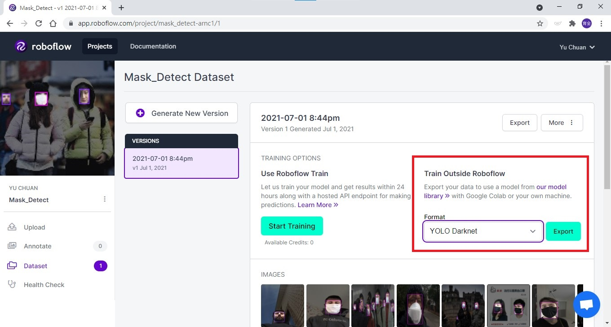
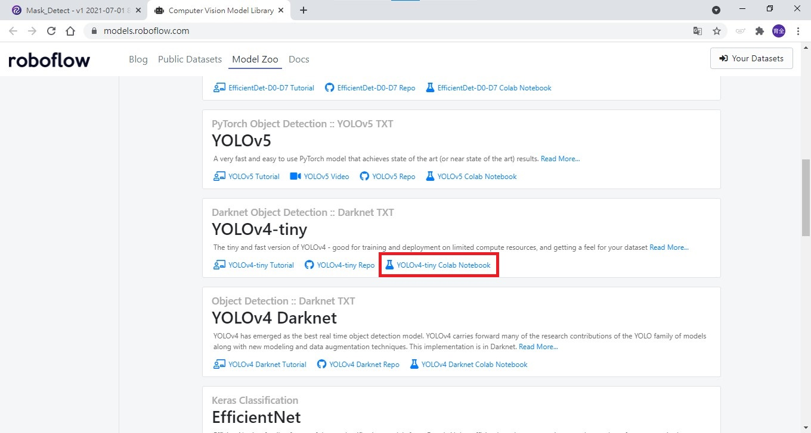
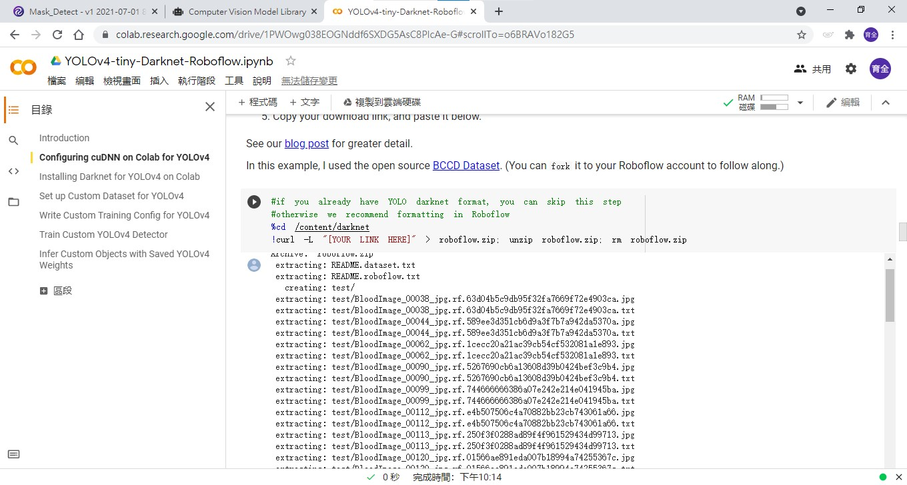
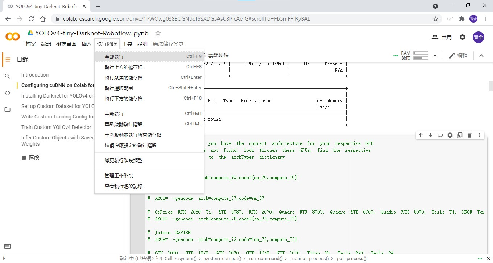

# 利用Colab做訓練

一般人使用者電腦的算力有限，可以借助Colab做訓練，如果有付費可以使用到P100的算力。

在建立好的專案版本右邊能看到Train Outside Roboflow，Format可以選擇要使用的格式。

這裡選擇 YOLO Darknet 後按下Export，會出現一個小視窗，將中間的被框列包含網址的部分複製。

注意這段網址不要洩漏給他人，含有帳號的敏感資訊。




<br/>
<br/>


接下來可以按下our model library的連結，可以看到有許多的範例文件。

這裡找到YOLOv4-tiny，點選colab Notebook。

_網址 : https://models.roboflow.com/_




<br/>
<br/>

打開colab範例後，尋找[YOUR LINK HERE]這一段，並將整行文字修改成剛剛複製的那段。




<br/>
<br/>

修改完成後就可以全部執行了，執行時間可能會很長，但Colab會有TimeOut的問題，閒置太久會被中斷執行，可以開啟開發者工具(F12)，在Console底下加入一段JavaScript。

```js
function KeepClicking(){
console.log("Clicking");
document.querySelector("colab-connect-button").click()
}
setInterval(KeepClicking,60000)
```




<br/>
<br/>