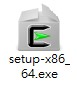
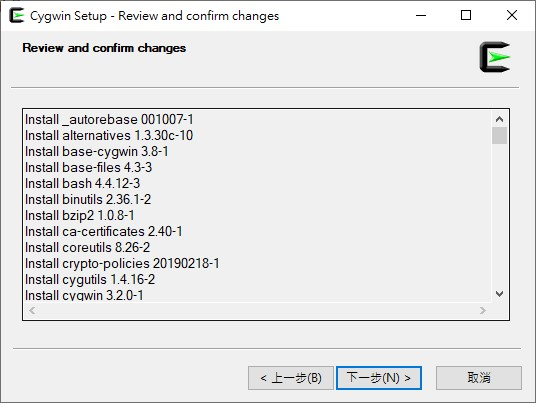
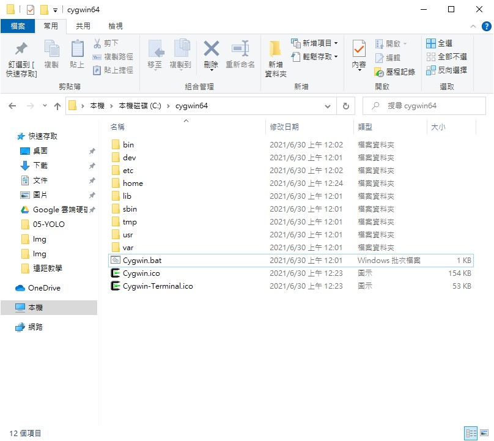
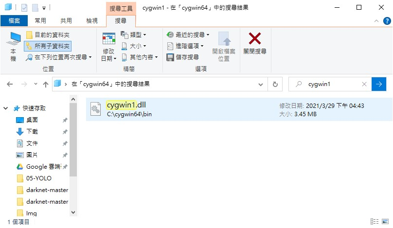

# Darknet for Windows

在Windows上使用Darknet很麻煩，需要先把Darknet編譯成EXE檔才能使用。

 
 

## 下載Draknet

在GitHub上將Darknet的Opensource下載並解壓縮，盡量放置於C槽的根目錄。

像是「C:/darknet-master」

Github : https://github.com/pjreddie/darknet

解壓縮後至Darknet官網下載欲使用的權重檔並放置路徑內，CFG可以不用下載，資料夾內已包含。

darknet資料夾檔案:

+ cfg : 官網上的模型檔，幾乎都有。
+ data : 有很多可以使用的範例圖片，例: dog.jpg , person.jpg , horses.jpg。

 
 

# 安裝Cygwin

下載網站[http://www.cygwin.com/](http://www.cygwin.com/)

進到網址後可以看到下載檔案。

 

下載完成後執行安裝檔。

 

打開安裝程式後可以看見一些提醒與官方網址，這裡下一步即可。

 

預設Install from Internet即可。

 

選擇安裝路徑，沒有特別需求就預設就好。

 

這是安裝檔的暫存路徑，安裝完後可以在這個路徑下將安裝檔刪除。

 

下載連結方式，這裡直接下一步即可。

 

這裡在取得鏡像連結，需要等約一分鐘。

 

## 如果抓不到鏡像清單，解決方式有兩個。

1. 重新下載安裝檔。
2. 手動輸入鏡像連結。

 

選擇位置較近的連結下載速度會快許多，如果上一步有出現錯誤，清單會變成空白，只要手動輸入網址就可以了。

 

一樣稍等一下即可。

 

這裡選擇需要的組件，在Search輸入關鍵字，找到該選項後將Skip修改成欲安裝的版本即可。

需要的組件:

+ gcc-core
+ gcc-g++
+ make
+ binutils

安裝版本建議不要選Test。

 

檢視將會安裝的組件，這裡下一步即可。

 

安裝過程，等候數分鐘。

 

按照自己需求勾選。

+ [x] Create icon on Desktop : 建立桌面捷徑
+ [x] Add icon to Start Menu : 

 

到此安裝已經完成，可以去路徑下找到檔案

 
 
 

# 編譯Darknet

在Cygwin路徑下找到Cygwin.bat執行檔並執行，會打開一個cmd視窗。

輸入指令確認版本與運行狀態是否正常。

>cygcheck -c cygwin

 

確認運行狀態正常之後就可以編譯Draknet。

先移動到剛剛解壓縮完成的Darknet資料夾裡。

>cd c:\darknet-master

在執行make指令進行編譯。

>make

 

編譯完成會發現Darknet資料夾內會出現一個exe檔，這時資料夾內會缺少cygwin1.dll。

 

cygwin1.dll最方便且安全的方法是從cygwin的安裝路徑下搜尋，直接複製到Darknet資料夾內即可。

 
 
 

# 使用Darknet做YOLO影像辨識

編譯完成的exe檔無法直接打開使用，必須開啟cmd視窗。

_快捷鍵: Win+R -> cmd_

先移動到darknet.exe的所在路徑。

例:
> cd C:/darknet-master

然後再執行預測指令。

指令: darknet detect 'CFG檔位置' '權重檔位置' '預測圖片位置'

可以使用相對路徑，記得加上副檔名。

例:
>darknet detect cfg/yolov3.cfg yolov3.weights data/dog.jpg

 

預測時要耐心等候一下，執行完就會出現圖片中被框列物體的名稱與機率。

 

預測完資料夾內會多出一個prediction的圖檔，即是已經框列後的圖片。

