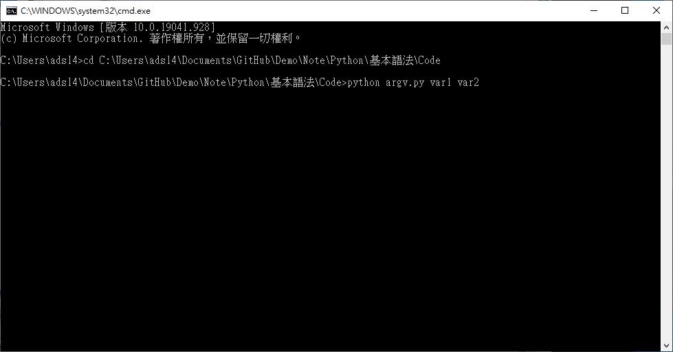
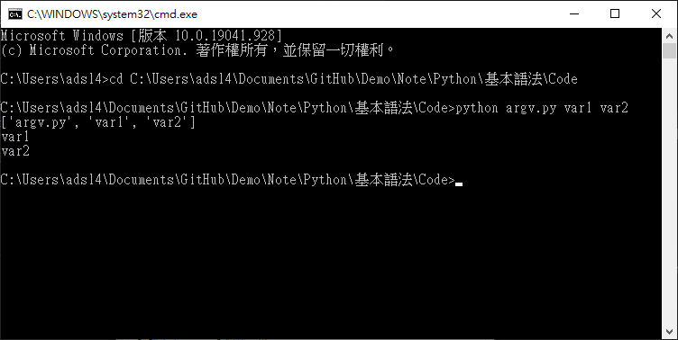

# Sys.argv
程式執行時，可以給予參數，以方便靈活使用。

在cmd執行python指令加上要給予的數值，以空格作為分隔。



argv就是取得這些值的屬性，資料型態為List，第一個值(sys.argv[0])必定為檔案路徑。

顯示所有參數
```python
print(sys.argv)
```

顯示某個參數，如果沒給予參數的話會出錯，所以用if包裝。
```python
#如果參數大於一個以上。
if len(sys.argv)>1:
    print(sys.argv[1])  #顯示第一個參數

if len(sys.argv)>2:
    print(sys.argv[2])  #顯示第一個參數
```

