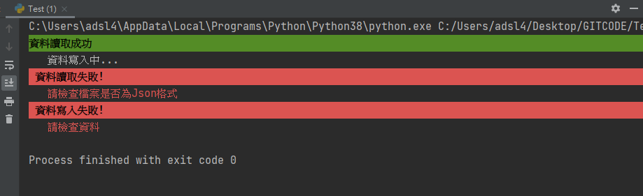

# Print
print的四種方式
## 1. print(x)
+   基本用法
## 2. print("x1=",x1,"x2=",x2)
+   我常用的方式
## 3. print("x1="+x1+"x2="+X2)
+   串接的內容物必須全部相同型別 ，如是字串要加上轉型。
## 4. print("x1=%d x2=%s" % (x1,x2))
+   類似C++的作法  %d=整數型別 %s=string %f=float
+   可以用於float取小數
+   |參數|用意|
    |---|:---:|
    |%d|整數|
    |%f|浮點數|
    |%1f|倍精度浮點數|
    |%c|字元|
    |%s|字串|

```python
    print("a=%.1f" % a) #取小數點後一位
```
## Python 2.0 3.0寫法略為不同
2.0不加括號 ```print"Hello" ```
3.0加上括號即可

<br/>
<br/>
<br/>

# 美化
_參照code：print.py_<br/>

print到終端機時都同一樣式，看起來很無聊，可以更改樣式、字體顏色、背景顏色，讓畫面更好看。

只要在文字前加上這段關鍵字即可

\033[顯示效果;字體色;背景色m

元素的位置其實沒差，每個元素都要以(；)符號做區隔，最後一個元素結束時加上小寫的m即可。

需注意的是下一個print也會受到影響，只要給予0m元素，就會正常了。

範例:
```python
print('\033[1;42;30m資料讀取成功')  #會印出 粗體、綠色背景、黑色字體。
print('\033[0m   資料寫入中...')    #回歸預設。

#或是在print結果放一個預設
print('\033[1;41;30m 資料寫入失敗!\033[0m') #但背景色效果會隨著文字結束斷掉。
```

效果展示：


|代碼|說明|
|---|---|
|0|終端預設|
|1|粗體字|
|4|下底線|
|5|閃爍(試不出效果)|
|7|反白(白底黑字)|
|8|不可見((試不出效果))|


<br/>


|字體|背景|顏色|
|---|---|---|
|30|40|黑色|
|31|41|紅色|
|32|42|綠色|
|33|43|黃色|
|34|44|藍色|
|35|45|紫紅色|
|36|46|青藍色|
|37|47|白色|