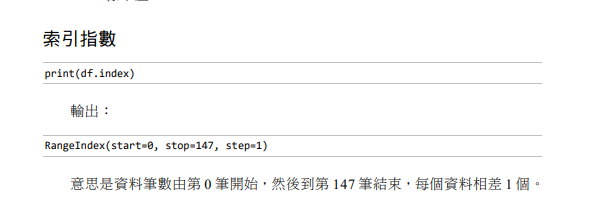
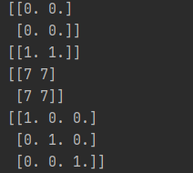
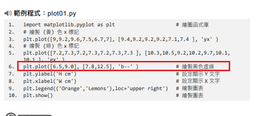
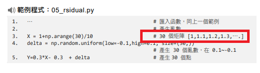
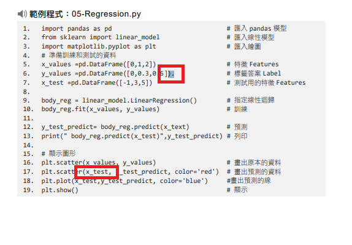

# 課本修正
# 13章
+ 13-2頁
  + 範例程式第八行註解，應該為「狀態2」。
+ 13-8頁
  + 執行結果中「Hi Powen! Thanks for the conversation!」，範例AIML檔並沒有後面這段文字。

# 14章

+ 14-2頁
  + 14.2小節的第二行，會需要使用不同的函「式」庫。
  + 頁尾的範例程式 import socketserver 「as socketserver」，有點多餘。
+ 14-3頁
  + 上方範例碼 print('Server Listening on port %s'% port).  <<多了一個點
+ 14-4頁
  + 範例程式的15行與28行，結尾各多一個點。
+ 14-7頁
  + 14.5小節說明中， self.rfile.read(varLen)這一個屬性 ，用詞感覺不太對，應該是「使用此方法讀取varLen此屬性的值」。
+ 14-8頁
  + py範例程式，函式庫匯入相同，但其實有新增不同的 「from urllib.parse import parse_qs」。

# 16章
+ 16-15頁
  
  此段落在16-13頁下面已經有了，重複。

# 17章
+ 17-1頁
  + 範例程式01的第三行 輸出資料型態"<type 'numpy.ndarray'>" ，實際使用是「<class 'numpy.ndarray'>」
+ 17-2頁
  + 範例程式第二、四、六、八行的註解，更改為「定義2*2的二維陣列，資料全部為0。」，語意會比較通順。
  + 範例程式第八行，正確是「定義[3,3]的二維陣列」。
  + 執行結果的部分，多處誤植。
   
    應該為此圖。 
    
+ 17-4頁
  + 課本從上看第二行[row頭,尾:col頭,尾]，逗號與冒號相反，應該是[row頭:尾,col頭:尾]。
+ 17-5頁
  + 範例程式第三行，輸出結果測試為int32，17-6頁也是。
+ 17-6頁
  + 表格中INT8的說明，「字元」應該「整數」。
+ 17-7頁
  + 重要!!範例程式上平方的函式 np.sqrt(x)，正確是「平方根」，平方的函式正確為 np.square(x)。

# 19章
+ 19-5頁 
   
  這一段畫出來的線是藍色的，黑色是'k--'

+ 19-9頁 
   
  應該是30個浮點數的矩陣

+ 19-11頁 
   
  1. 多一個無意義的點(.)
  2. x_test是2維的資料，沒辦法畫圖，應該要用x_test.values。